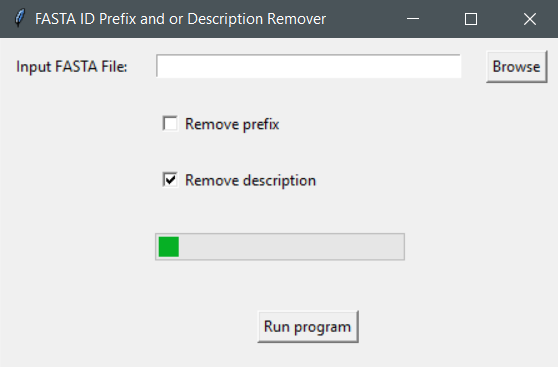

# FASTA-ID-Prefix-and-or-Description-Remover

Windows FAST GUI app that can remove inplace the FASTA id prefixes and/or FASTA descriptions from a FASTA file

## Dependencies

1. Windows 11 or 10 version 16215.0 or higher(type `winver` on the search button and click `winver` to find your OS version)
2. [Windows Subsystem for linux(wsl1)](INSTALL.md)
3. the file in the `bin` folder

Click on the `FASTA ID Prefix and or Description Remover.exe` file

Click `browse` and select an input file

Click `Run program` 

**Note: The program removes the FASTA id prefixes and/or FASTA descriptions inplace**

Example input/output files can be found [here](data/)

Input file for `example 1` was downloaded from solgenomics.net tomato annotation version 4.1.

Input file for `example 2` was downloaded from ncbi.

Input file for `example 3` was downloaded from lotus base(MG20 v3.0 proteins file).
